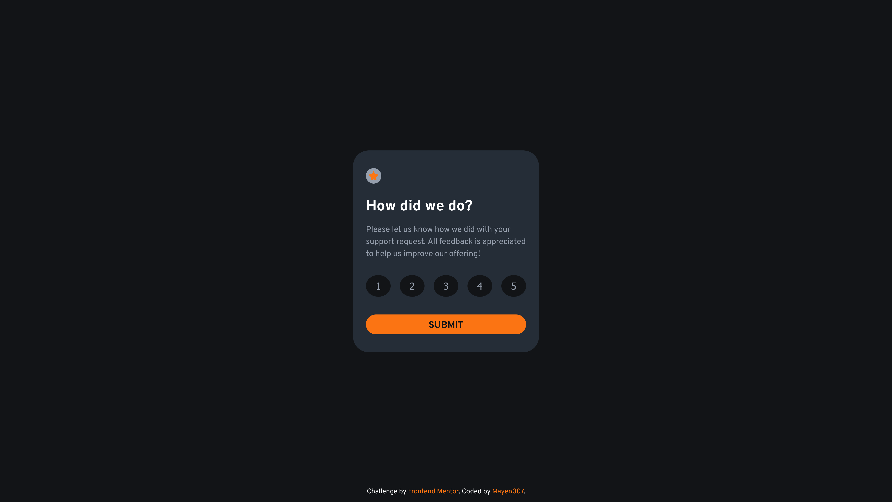

# Frontend Mentor - Interactive Rating Component Solution

This is my solution to the [Interactive Rating Component challenge on Frontend Mentor](https://www.frontendmentor.io/challenges/interactive-rating-component-koxpeBUmI). This project allowed me to practice creating an interactive UI component with a focus on responsiveness and user experience.

## Table of Contents

- [Overview](#overview)
  - [The Challenge](#the-challenge)
  - [Screenshot](#screenshot)
  - [Links](#links)
- [My Process](#my-process)
  - [Built With](#built-with)
  - [What I Learned](#what-i-learned)
  - [Continued Development](#continued-development)
  - [Useful Resources](#useful-resources)
- [Author](#author)

---

## Overview

### The Challenge

Users should be able to:

- View the optimal layout for the app depending on their device's screen size.
- See hover and focus states for all interactive elements.
- Select and submit a number rating.
- View a "Thank you" message after submitting their rating.

### Screenshot



### Links

- **Solution URL:** [GitHub Repository](https://github.com/Mayen007/Interactive-rating-component)
- **Live Site URL:** [GitHub Pages](https://mayen007.github.io/Interactive-rating-component/)

---

## My Process

### Built With

- Semantic HTML5 markup
- CSS custom properties
- Flexbox for layout
- Mobile-first workflow
- Vanilla JavaScript for interactivity
- [Overpass](https://fonts.google.com/specimen/Overpass) font

---

### What I Learned

This project helped me improve my skills in responsive design, CSS styling, and JavaScript interactivity. Here are some key takeaways:

1. **Dynamic User Feedback with JavaScript:**

   - Handling user interactions dynamically using `data-attributes`.

   ```javascript
   ratingButtons.forEach((button) => {
     button.addEventListener("click", () => {
       rating = parseInt(button.dataset.rating, 10);
       button.classList.add("selected");
     });
   });
   ```

### Responsive Design

A mobile-first workflow ensured that the layout was optimized for small screens first.

---

## Continued Development

In future projects, I aim to:

- Dive deeper into accessibility features like `aria-pressed` and `aria-live`.
- Experiment with animations for smoother transitions.
- Implement state management with libraries like React for similar projects.

---

## Useful Resources

- [MDN Web Docs](https://developer.mozilla.org/) - For HTML, CSS, and JavaScript documentation.
- [CSS-Tricks](https://css-tricks.com/) - Helped with hover and focus state designs.
- [Frontend Mentor Slack Community](https://frontendmentor.io/slack) - Great for getting feedback and advice.

---

## Author

- **Frontend Mentor:** [@Mayen007](https://www.frontendmentor.io/profile/Mayen007)
- **GitHub:** [Mayen007](https://github.com/Mayen007)
